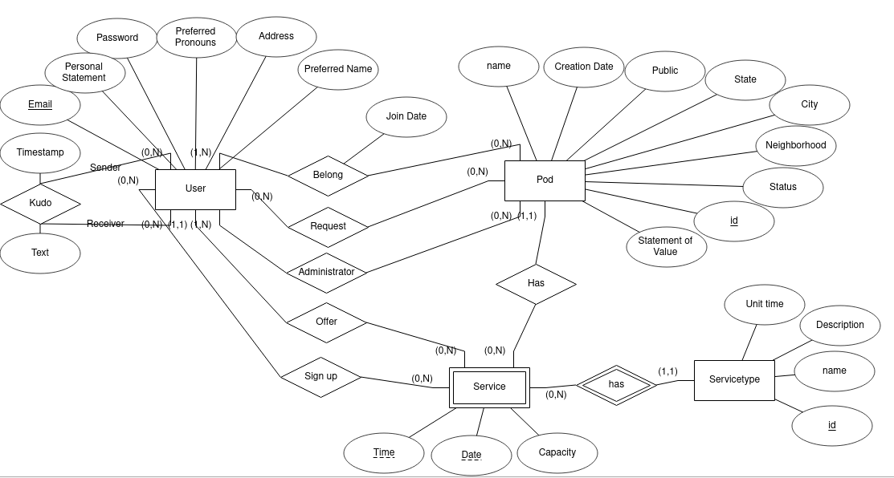

# Question 1



Notes:

- `Pod-Status` is expected to be a boolean. True means Open and False for Close
- `Pod-Public` is expected to be a boolean. True means Public and Flase means Private

# Question 2

```
Drivers(id, name, day_joined, license_no) Key: id
Drive(driver_id, vehicle_id) Key: driver_id, vehicle_id
Vehicles(id, make, license_plate, color, year, driver_id) Key: id
Rides(id, start_time, price, price_tier, tolls, date, vehicle_id, driver_id) Keys: id
RouteSegments(segment_order, end_time, start_time, end_point, start_point, ride_id) Key: segment_order, ride_id
RatingComments(id, text, ride_id, rider_id) Key: id
Riders(id, name, day_joined, phone_no, CCNo) Key: id
ParticipateIn(rider_id, ride_id) Key: rider_id, ride_id
RatingsTypes(name, sacle, description) Key: name
Rates(rating_type_id, rider_id, ride_id, value) Key: rating_type_id, rider_id, ride_id
```